# Compte rendu intermédiaire numéro 1 - modélisation

Nous allons nous intéresser à trois cas d'études typiques des problèmes SAT.
Nous commencerons tout d'abord par expliquer comment nous pouvons introduire
la notion de graphe dans les trois problèmes énoncés. Puis nous proposerons une méthode
de résolution qui utilise la théorie des graphes. Et qui est applicable aux trois
problémes posés.

Un fichier pour jupyter notebook contenant le code de toutes les productions de graphes pour nos exemples est disponible dans notre dépôt : [ipynb/dm-graph-cr1.ipynb](ipynb/dm-graph-cr1.ipynb)

## Modélisation du sudoku

Dans le cas d'une grille de Sudoku. La position d'un chiffre dans une case de la grille de jeu
posera comme contrainte. Que pour tout autres chiffres sur la même ligne, colonne et carré.
Ceux-ci doivent être tous différents les uns des autres.

Ainsi on peut en conclure que les cases qui se situent sur la même ligne, colonne et carré.
Sont dépendantes les unes des autres. On propose un exemple de cela sur une grille de dimensions $`4 \times 4`$:

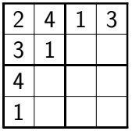

Ceci vaut pour toutes les grilles de dimensions $`N \times N`$, où une telle grille est carrée et divisée en 
$`N`$ régions de $`N`$ cases. Soit un total de $N\times N$ cases. Où l'on retrouve donc dans chaque ligne, colonne et chaque région/carré.
Les chiffres de $`1`$ à $`N`$ apparaissent une et une seule fois.

Nous proposons maintenant de la mise en évidence de la traduction des grilles.
En un tableau binaire où les lignes et les colonnes sont les cases du Sudoku.
Le code binaire permet donc ici l'expression de la dépendance entre chaque case.
Si l'on reprend notre grille de dimensions $`4 \times 4`$. Nous prenons volontairement ces dimensions
pour pouvoir exposer nos propositions qui sont applicables à toutes dimensions. Effectivement
une grille $`9\times 9`$ contient $`81`$ cases. On peut donc définir notre tableau pour notre grille
$`4 \times 4`$ comme ceci :

---| 1 	 | 2   | 3 	| 4   | 5   | 6   | 7  | 8  | 9 | 10 | 11 | 12 | 13 | 14 | 15 | 16 |
---|-----|-----|----|-----|-----|-----|----|----|---|----|----|----|----|----|----|----|
1  | 0 	| 1   | 1 	| 1   | 1   | 1   | 0  | 0  | 1 | 0  | 0  | 0  | 1  | 0  | 0  | 0  |
2  | 1  | 0   | 1   | 1   | 1   | 1   | 0  | 0  | 0 | 1  | 0  | 0  | 0  | 1  | 0  | 0  |
3  | 1  | 1   | 0   | 1   | 0   | 0   | 1  | 1  | 0 | 0  | 1  | 0  | 0  | 0  | 1  | 0  |
4  | 1  | 1   | 1   | 0   | 0   | 0   | 1  | 1  | 0 | 0  | 0  | 1  | 0  | 0  | 0  | 1  |
5  | 1  | 1   | 0   | 0   | 0   | 1   | 1  | 1  | 1 | 0  | 0  | 0  | 1  | 0  | 0  | 0  | 
6  | 1  | 1   | 0   | 0   | 1   | 0   | 1  | 1  | 0 | 1  | 0  | 0  | 0  | 1  | 0  | 0  | 
7  | 0  | 0   | 1   | 1   | 1   | 1   | 0  | 1  | 0 | 0  | 1  | 0  | 0  | 0  | 1  | 0  | 
8  | 0  | 0   | 1   | 1   | 1   | 1   | 1  | 0  | 0 | 0  | 0  | 1  | 0  | 0  | 0  | 1  | 
9  | 1  | 0   | 0   | 0   | 1   | 0   | 0  | 0  | 0 | 1  | 1  | 1  | 1  | 1  | 0  | 0  | 
10 | 0  | 1   | 0   | 0   | 0   | 1   | 0  | 0  | 1 | 0  | 1  | 1  | 1  | 1  | 0  | 0  | 
11 | 0  | 0   | 1   | 0   | 0   | 0   | 1  | 0  | 1 | 1  | 0  | 1  | 0  | 0  | 1  | 1  | 
12 | 0  | 0   | 0   | 1   | 0   | 0   | 0  | 1  | 1 | 1  | 1  | 0  | 0  | 0  | 1  | 1  | 
13 | 1  | 0   | 0   | 0   | 1   | 0   | 0  | 0  | 1 | 1  | 0  | 0  | 0  | 1  | 1  | 1  | 
14 | 0  | 1   | 0   | 0   | 0   | 1   | 0  | 0  | 1 | 1  | 0  | 0  | 1  | 0  | 1  | 1  | 
15 | 0  | 0   | 1   | 0   | 0   | 0   | 1  | 0  | 0 | 0  | 1  | 1  | 1  | 1  | 0  | 1  | 
16 | 0  | 0   | 0   | 1   | 0   | 0   | 0  | 1  | 0 | 0  | 1  | 1  | 1  | 1  | 1  | 0  | 

Où $`1`$ correspond à une dépendance et $`0`$ l'indépendance entre le couple de cases.

Nous pouvons donc considérer ce tableau comme une matrice d'adjacence.
Les entêtes sont les cases de notre grille.
A partir de cette matrice nous pouvons former un graphe simple non-orienté qui
va représenter notre grille de sudoku. Dans lequel, les sommets sont les cases de la grille,
et les arêtes représente la présence de la valeur $`1`$ dans la cellule du tableau binaire
pour deux numéros de cases qui sont les coordonnées du tableau. Et qui sont donc les deux sommets
dans le graphe où il y existe une arête. Si la valeur $`0`$ est contenu dans une cellule du tableau.
Alors cela vient indiquer la non dépendance entre les deux sommets et donc non présence d'une arête
entre-eux.

Nous proposons la génération de ce graphe $`G`$ à l'aide de la bibliothéque NetworkX :

```py
import numpy as np
import matplotlib.pyplot as plt
import networkx as nx


M = [[0, 1,	1,	1,	1,	1,	0,	0,	1,	0,	0,	0,	1,	0,	0,	0],
	[1,	0,	1,	1,	1,	1,	0,	0,	0,	1,	0,	0,	0,	1,	0,	0],
	[1,	1,	0,	1,	0,	0,	1,	1,	0,	0,	1,	0,	0,	0,	1,	0],
	[1,	1,	1,	0,	0,	0,	1,	1,	0,	0,	0,	1,	0,	0,	0,	1],
	[1,	1,	0,	0,	0,	1,	1,	1,	1,	0,	0,	0,	1,	0,	0,	0],
	[1,	1,	0,	0,	1,	0,	1,	1,	0,	1,	0,	0,	0,	1,	0,	0],
	[0,	0,	1,	1,	1,	1,	0,	1,	0,	0,	1,	0,	0,	0,	1,	0],
	[0,	0,	1,	1,	1,	1,	1,	0,	0,	0,	0,	1,	0,	0,	0,	1],
	[1,	0,	0,	0,	1,	0,	0,	0,	0,	1,	1,	1,	1,	1,	0,	0],
	[0,	1,	0,	0,	0,	1,	0,	0,	1,	0,	1,	1,	1,	1,	0,	0],
	[0,	0,	1,	0,	0,	0,	1,	0,	1,	1,	0,	1,	0,	0,	1,	1],
	[0,	0,	0,	1,	0,	0,	0,	1,	1,	1,	1,	0,	0,	0,	1,	1],
	[1,	0,	0,	0,	1,	0,	0,	0,	1,	1,	0,	0,	0,	1,	1,	1],
	[0,	1,	0,	0,	0,	1,	0,	0,	1,	1,	0,	0,	1,	0,	1,	1],
	[0,	0,	1,	0,	0,	0,	1,	0,	0,	0,	1,	1,	1,	1,	0,	1],
	[0,	0,	0,	1,	0,	0,	0,	1,	0,	0,	1,	1,	1,	1,	1,	0]]

G = nx.from_numpy_matrix(np.array(M), create_using=nx.Graph())
pos = nx.circular_layout(G)
labels = {i : i + 1 for i in G.nodes()}
nx.draw_networkx_labels(G, pos, labels, font_size=13)
nx.draw_circular(G)
```

Ainsi l'on obtient la production de l'image de notre graphe :

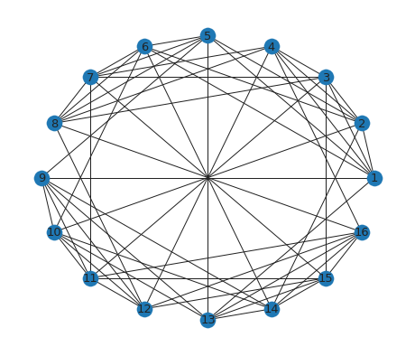

On peut constater que les cases qui ne sont pas dépendantes les unes des autres sont donc des sommets non-adjacent.
Et que les cases dépendantes sont représentées par des sommets adjacents.

Nous reprenons le même jeu de grille que précédemment mais en y donnant une solution partielle :

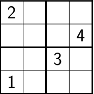

Nous proposons de colorier les cases déjà connues. De manière à ce qu'on ne retrouve pas la même couleur pour des chiffres différents :

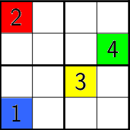

Puisque les cases non inter-dépendantes peuvent avoir le même chiffre. Et que nous avons une attribution de couleur pour certains chiffre. Alors nous pouvons chercher une solution à partir de la solution partielle que nous donnes la coloration des cases déjà connues. Ce qui nous permet donc déjà pouvoir colorier certains sommets du graphe : 

```py
fig, ax = plt.subplots()
ax.set_facecolor("white")

# '#1f78b4' = default nodes color

color_list = ['red','#1f78b4','#1f78b4','#1f78b4','#1f78b4','#1f78b4','#1f78b4','green','#1f78b4','#1f78b4','gold','#1f78b4','blue','#1f78b4','#1f78b4','#1f78b4']

nx.draw_networkx_labels(G, pos, labels, font_size=13)
nx.draw_networkx_nodes(G,pos,node_color=color_list,alpha=0.8)
nx.draw_networkx_edges(G,pos)
```


Il nous faut maintenant déterminer dans le graphe les ensembles des partitions des sommets non-adjacents. Il s'agit donc de trouver les ensembles des stables de $`G`$. Et de choisir l'ensemble pour lequel à chaque partition, on puisse attribuer une unique couleur, donc un chiffre entre $`1`$ à $`N`$ (pour un graphe de dimensions $`N \times N`$).

Voici un des ensembles de stables possible du graphe $`G`$ qui permet une solution pour une grille $`4 \times 4`$:

$`S = \{\{1,7,10,16\}, \{2,8,9,15\}, \{3,6,13,12\}, \{4,5,11,14\}\}`$

Etant donné qu'à chaque début de Sudoku une solution partielle est donné avec des chiffres déjà placés comme vue précédemment. Nous pouvons résoudre notre Sudoku en attribuant à tous les sommets qui font partie du même ensemble stable que l'un des sommets déjà colorés. La même couleur que ce sommet déjà coloré. Si un ensemble d'ensembles de stables contient un ensemble stable qui ne possède aucun sommet coloré par la solution partielle, donc aucune case faisant partie de la solution partielle du départ. Il suffit de lui attribuer une couleur différente de tous les autres ensembles stables de l'ensemble de stables.  

Ce qui permet de pouvoir attribuer une couleur à chaque ensemble stables de $`S`$ pour notre graphe :

$`\{1,7,10,16\} : Red\\ \{3,6,13,12\}   : Blue\\
\{2,8,9,15\}    : Green\\   \{4,5,11,14\} : Gold`$

Nous pouvons donc modifier notre graphe couleur :

```py
fig, ax = plt.subplots()
ax.set_facecolor("white")

color_list = ['red','green','blue','gold','gold','blue',
              'red','green','green','red','gold','blue',
              'blue','gold','green','red']

nx.draw_networkx_labels(G, pos, labels, font_size=13)
nx.draw_networkx_nodes(G,pos,node_color=color_list,alpha=0.8)
nx.draw_networkx_edges(G,pos)
```


Et pour finir nous pouvons attribuer un chiffre à chaque couleur, étant donner que les couleurs dans notre graphe représente les chiffres qui nous donne donc la solution :

$`
\{1,7,10,16\} : Red = 2 \\   \{3,6,13,12\}   : Blue = 1 \\
\{2,8,9,15\}    : Green = 4 \\ \{4,5,11,14\} : Gold = 3
`$

La résolution de notre Sudoku est donc effectué par cette affectation d'une
couleur par ensemble stable. Et donc un chiffre de $`1`$ à $`N`$ par couleur.

Voici donc la grille résolue qui vient vérifier :


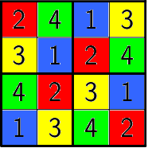

Nous avons donc pu résoudre ce problème en le traduisant en un tableau qui représente les dépendances entre chaque case.
Ce qui nous a ainsi permis de pouvoir créer à partir de ce tableau. Un graphe simple non-orienté ou les sommets sont les cases et les arêtes une dépendance
entre les cases de la grille de Sudoku. L'objectif à ce niveau étant de déterminer les ensembles des stables du graphe pour attribuer à chacun un une couleur et donc un numéro une fois entre 1 et 4. En prenant en compte au préalable la solution partielle donné avec une partie de l'attribution de couleur que l'on peut donner au départ. Cela revient donc à attribuer à chaque partition de stable une couleur et donc un chiffre, et donc aux cases représentées par les sommets dans le Sudoku. 

## Modélisation du coloriage de cartes

Pour exprimer notre démarche sur le coloriage des cartes. Nous proposons de prendre pour exemple la carte du Caucase.

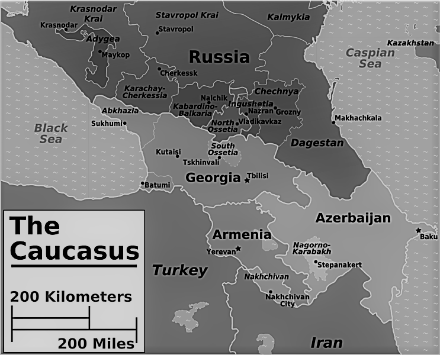
[Source](https://commons.wikimedia.org/wiki/File:Caucasus_regions_map.png)

Ainsi le problème ici est de pouvoir colorier les pays de façon à ce que les pays voisins n'aient pas la même
couleurs. Une réponse naïve serait de colorier tous les pays de manière différente. Mais puisque les pays non frontaliers
peuvent avoir la même couleur. Alors il est possible limiter, de minimiser le nombre de couleur nécessaire à utiliser.

Nous pouvons faire dans un premier temps un tableau binaire avec tous les pays.
Et noter par un code binaire s'ils sont frontaliers ou non. $`1`$ pour frontalier et $`0`$ pour non frontalier.
Voici le tableau pour la carte du Caucase :

------------| Géorgie   | Arménie   | Turquie   | Iran   | Azerbaidjan   | Russie   |
------------|-----------|-----------|-----------|--------|---------------|----------|
Géorgie     | 0         | 1         | 1         | 0      | 1             | 1        |
Arménie     | 1         | 0         | 1         | 1      | 1             | 0        |
Turquie     | 1         | 1         | 0         | 1      | 0             | 0        | 
Iran        | 0         | 1         | 1         | 0      | 1             | 0        |
Azerbaidjan | 1         | 1         | 0         | 1      | 0             | 1        |
Russie      | 1         | 0         | 0         | 0      | 1             | 0        |

Le tableau peut donc être lu comme une matrice. Et cette matrice peut être traduite en un graphe
ou les sommets représentent les pays et les arêtes une frontière entre deux pays. Deux sommets adjacents
sont donc deux pays frontaliers. Et deux sommets non adjacents sont don des pays non frontaliers.
Ainsi à partir de cette matrice nous pouvons produire le graphe simple non-orienté $`G`$ :

```py
mCartes = [
[0, 1, 1, 0, 1, 1],
[1, 0, 1, 1, 1, 0],
[1, 1, 0, 1, 0, 0],
[0, 1, 1, 0, 1, 0],
[1, 1, 0, 1, 0, 1],
[1, 0, 0, 0, 1, 0]
]

CC = nx.from_numpy_matrix(np.array(mCartes), create_using=nx.Graph())
pos = nx.circular_layout(CC)
pays = ['Géorgie', 'Arménie', 'Turquie', 'Iran', 'Azerbaidjan', 'Russie']
labels = [(i,pays[i]) for i in range(len(pays))]

nx.draw_networkx_labels(CC, pos, dict(labels), font_size=13)
nx.draw_circular(CC)
```

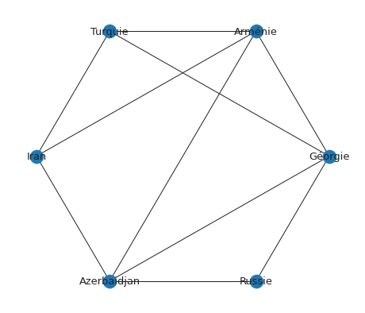

Il nous faut déterminer le nombre de couleurs minimal que nous pouvons utiliser dans la carte.
Cela revient à chercher le nombre de couleurs minimal nécessaire pour colorier les sommets du graphe ci-dessus.
De façon à ce que deux sommets adjacents ne puissent avoir la même couleur. Ce qui est une recherche de minimisation du nombre chromatique
qui permet de résoudre notre problème.

Nous allons donc proposer un ensemble d'ensembles stables qui permet une solution :

$`S = \{\{Russie, Arménie\}, \{Azerbaidjan, Turquie\}, \{Géorgie,Iran\}\}`$

Nous pouvons donc attribuer les couleurs aux pays dans chaque ensembles. Par exemple :


$`\{Russie, Arménie\}      : Green\\
\{Azerbaidjan, Turquie\} : Red\\
\{Géorgie,Iran\}         : Gold
`$

Nous pouvons constater que plus le nombre de stables est réduit. Moins nous n'aurons de couleurs
dans le graphe. On peut constater donc ici que :

$`\chi(G) = \vert S\vert`$

Où $`\chi (G)`$ désigne le nombre chromatique du graphe $`G`$ et $`\vert S \vert`$ la cardinalité de notre ensemble de stables. 

Nous apporterons plus d'éléments au sujet de l'encadrement du nombre chromatique lors de la mise en commun des trois problèmes en fin de rapport.

Nous pouvons donc définir notre graphe couleur en réutilisant le graphe NetworkX du code python précédent pour vérifier :

```py
fig, ax = plt.subplots()
ax.set_facecolor("white")

color_list = ['gold', 'green', 'red', 'gold','red','green']

nx.draw_networkx_labels(CC, pos, dict(labels), font_size=13)
# ajout du param node_color
nx.draw_networkx_nodes(CC,pos,node_color=color_list)
nx.draw_networkx_edges(CC,pos)
```

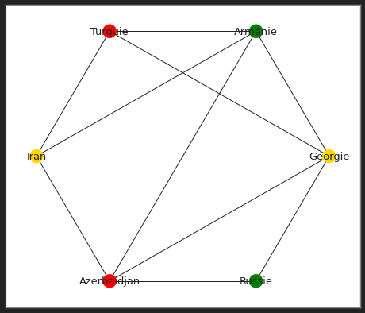

Ainsi on peut constater que pour notre carte du Caucase, la coloration de son graphe nous a permis la résolution du problème. Et que Le nombre chromatique nécessaire est celui attendu :

$`\chi (G) = 3`$

Chercher à résoudre le problème de coloration des cartes revient donc à déterminer le nombre chromatique du graphe issu du problème ou les sommets représentent les pays et les arêtes les frontières entre ces pays.

## Modélisation de l'attribution de fréquences

Nous allons traiter le cas de la gestion d'affectations de fréquences à un réseau factice d'antennes.

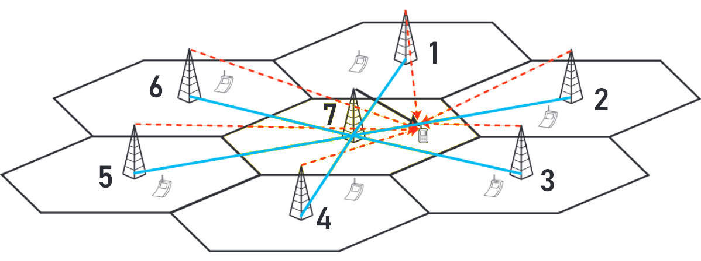
[Source (également donné en Citations)](http://jeia.fil.univ-lille1.fr/conferences/2018-jourdan.pdf)

On considère que deux antennes sont voisines si elles sont géographiquement. Suffisamment proches l'une de l'autre.
Pour que leur fréquence d'attribuées causes des interférences entre elles. Il est donc futile de prendre en considération
la distance entre celles-ci. Comme un facteur à part entière du moment qu'elles respectent une distance pour être ou non voisines.

L'objectif étant que les antennes voisines n'interfèrent pas entre elles. Il faut donc pouvoir attribuer à ces antennes
des fréquences différentes tout en utilisant un minimum de fréquences au total. Pour pouvoir fournir et faire fonctionner correctement
notre parc d'antennes.

On proposons dans un premier temps un tableau binaire qui prend en ligne et colonne chaque antenne. Et qui note par son code binaire
si deux antennes sont voisines ou non. Ainsi $`1`$ traduira le fait que deux antennes sont voisines. Et la valeur $`0`$ deux antennes non voisines.
Voici le tableau binaire correspondant pour notre exemple de réseau d'antennes sur l'image ci-dessus en début de cette section :

---| 1 	| 2 | 3 | 4 | 5 | 6 | 7 |
---|---|---|---|---|---|---|---| 
1  | 0 	| 1 | 0 | 0 | 0 | 1 | 1 | 
2  | 1  | 0 | 1 | 0 | 0 | 0 | 1 | 
3  | 0  | 1 | 0 | 1 | 0 | 0 | 1 | 
4  | 0  | 0 | 1 | 0 | 1 | 0 | 1 |
5  | 0  | 0 | 0 | 1 | 0 | 1 | 1 |
6  | 1  | 0 | 0 | 0 | 1 | 0 | 1 |
7  | 1  | 1 | 1 | 1 | 1 | 1 | 0 |

Comme lors des deux précédentes problématiques. Nous pouvons traduire ce tableau en une matrice.
A partir de laquelle nous pouvons construire un graphe simple non-orienté $`G`$. Dans lequel les
lignes/colonnes de la matrice seront les sommets. Et les arêtes seront données par la présence
de la valeur $`1`$ pour un couple de sommet dans la matrice. Les sommets représentent donc les 
antennes. Et les arêtes caractérisent une interférence entre deux antennes, leur proximité géographique.
Donc que ces deux antennes/sommets aux deux extrémités de l'arête sont considérées comme voisines.

Nous proposons la production d'un tel graphei $`G`$ à partir de la matrice :

```py
GSM = [
[0, 1, 0, 0, 0, 1, 1],
[1, 0, 1, 0, 0, 0, 1],
[0, 1, 0, 1, 0, 0, 1],
[0, 0, 1, 0, 1, 0, 1],
[0, 0, 0, 1, 0, 1, 1],
[1, 0, 0, 0, 1, 0, 1],
[1, 1, 1, 1, 1, 1, 0]]

fig, ax = plt.subplots()
ax.set_facecolor("white")

GG = nx.from_numpy_matrix(np.array(GSM), create_using=nx.Graph())
pos = nx.circular_layout(GG)
labels = {i : i + 1 for i in GG.nodes()}

nx.draw_networkx_labels(GG, pos, labels, font_size=13)
nx.draw_networkx_nodes(GG,pos)
nx.draw_networkx_edges(GG,pos)
```

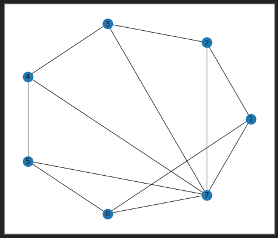

Puisque les antennes voisines ne doivent pas avoir la même fréquence. Alors les sommets adjacents
du graphe $`G`$ ne doivent pas porter la même fréquence. Ce problème peut être résolu à l'aide
d'une coloration des sommets du graphe $`G`$. Où chaque couleur représente une fréquence.

Il est donc ici, encore question de la recherche du nombre chromatique minimal à utiliser pour colorier le graphe et
pouvoir ainsi affecter nos fréquences aux antennes. De façon à ce que les sommets adjacents du graphe ne porte pas la même couleur.

Nous pouvons chercher dans un premier temps les ensembles des stables issus du graphe $`G`$. Pour pouvoir par la suite affecter
une couleur par ensemble stable. Ce qui reprend la démarche lors du problème précédent.

Voici une solution possible d'un ensemble de stables :

$`S = \{\{1,3,5\}, \{2,4,6\}, \{7\} \}`$

Ce qui nous permet d'attribuer des couleurs aux stables de cette solution :

$`\{1,3,5\} : Orange \\   \{7\} : Gold\\
\{2,4,6\} : Green`$

Ainsi en reprenant le graphe NetworkX précédent. Auquel nous pouvons attribuer les couleurs :

```py
fig, ax = plt.subplots()
ax.set_facecolor("white")

color_list = ['orange', 'green', 'orange', 'green','orange','green','gold']

nx.draw_networkx_labels(GG, pos, labels, font_size=13)
nx.draw_networkx_nodes(GG,pos,node_color=color_list)
nx.draw_networkx_edges(GG,pos)
```

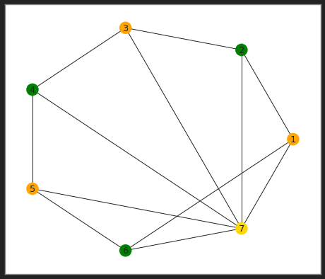

Ainsi nous pouvons visualiser à travers notre graphe couleur. Que notre solution permet de résoudre notre problème d'antennes.
Avec un nombre chromatique égal à $`3`$.

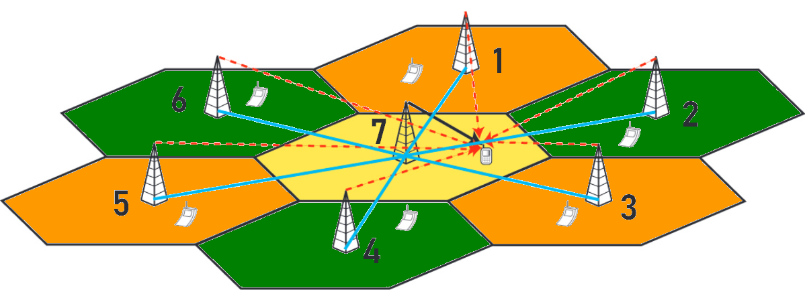

## Problème commun

Nous constatons que la résolution des trois problèmes posés. Peut être effectuée à l'aide de graphe couleur, simple (sans boucles et arêtes multiples) et non-orienté.
Dans lesquels cela revient à trouver les ensembles d'éléments stables
qui répondent à des contraintes ou compatibilités entre-eux selon des critères. Dans le cas du Sudoku, il fut question de cases dépendantes
les unes aux autres. Dans le cas des cartes, il était question de pays frontaliers. Et dans le cas des fréquences dans les réseaux GSM, il était question de la proximité entre les antennes qui nous a amené à les considérer comme voisines.

Par construction nous avons donc pu traduire les problèmes en des graphes simples et non-orientés. Où les sommets représentent les éléments et les arêtes les incompatibilités entre ces éléments. Nous faisons le choix
d'utiliser des graphes simples dans la résolution de nos problèmes. car il est seulement nécessaire de préciser si oui ou  non deux éléments sont incompatibles entre eux. Et donc de rendre ce graphe non-orienté pour permettre d'exprimer l'incompatibilité vers les deux extrémités des arêtes.

Ainsi cela revient à trouver un moyen de colorier un graphe $`G`$ en un nombre minimiser de couleur.
Comme nous l'avons introduit. Nous pouvons obtenir le nombre chromatique à partir de l'ensemble de stables d'un graphe.

Etant donné un graphe simple $`G=(V,E)`$ et $`S`$ l'ensemble des stables de $`G`$.
Où un stable de $`G`$ est un sous-ensemble de $`S`$. Dans lequel tous les sommets sont
non-adjacents deux-à-deux. Alors une $`k-coloration`$ de $`G`$ est une partition de $`S`$ en $`k`$ stables.

C'est-à-dire une application $`c`$ qui attribue à chaque sommet de $`G`$ une couleur de l'ensemble $`{1, ..., k}`$.
De façon à ce que tous les sommets voisins ont des couleurs différentes :

$`\forall u,v \in V(G) | \forall \{u,v\} \in E(G) \Rightarrow c(u) \ne c(v)`$

Et comme nous l'avons vue lors du problème de coloration de la carte du Caucause. Une $`k-coloration`$
de $`G`$ est division de l'ensemble $`V(G)`$ des sommets de $`G`$ en $`k`$ ensembles stables :

$`V(G) = v_1 \bigcup... \bigcup v_k`$

Où $`v_i`$ est l'ensemble des sommets coloriés $`i`$.

Ainsi si un graphe $`G`$ peut être colorié avec $`k`$ couleurs.
Alors on dit qu'il est $`k-coloriable`$. La recherche du $`k`$ qui détermine si un graphe est
$`k-coloriable`$ est un problème NP-hard pour $`k \geq 3`$. Et nous pouvons donc établir la relation
entre ce $`k`$ et le nombre chromatique $`G`$ noté $`\chi(G)`$. Qui est le nombre minimum
de couleurs nécessaire pour colorier $`G`$. On dit que $`G`$ est $`k-chromatique`$ si et seulement si
$`\chi(G) = k`$. Pour reprendre le problème du Sudoku $`9 \times 9`$, la solution est un graphe qui est $`9-coloriable`$.

Cette démonstration nous amènes donc au nombre chromatique.
Qui est ce que l'on souhaite obtenir pour permettre la coloration en un minimum de couleurs.

Le théorème de Brooks permet de définir une relation entre le degré maximal $`\Delta`$ d'un graphe $`G`$ connexe non orienté et son nombre chromatique $`\chi(G)`$ :

* $`\chi(G) = \Delta(G) + 1`$ si et seulement si :
	* $`\Delta(G) = 2`$ et $`G`$ est un cycle impair,
	* $`\Delta(G) \geq 2`$ et $`G`$ est le graphe complet à $`\Delta(G) +1`$ sommets.
* Sinon $`\chi(G) \leq \Delta(G)`$

Ainsi il faudra considérer cette encadrement pour pouvoir proposer une méthode de résolution intéressante.
Qui permettra la généralisation de la résolution de nos trois problèmes.

Un théorème également intéressant concernant la coloration des cartes. Est le théorème des quatres couleurs de Kenneth Appel et Wolfgang Haken, prouvé en 1976.
Qui nous dit que tout graphe planaire est $`4-coloriable`$. Ce théorème est néanmoins limité dans le cas du coloriage de cartes car il faut par exemple considérer une couleur pour la mer,
ou encore le fait que le théorème traite des régions connexes or les pays ne sont pas tous connexes. Ils peuvent inclure des îles par exemple.

Nous explorerons dans la partie suivante plus en détails les méthodes de résolution par l'utilisation d'algorithmes.

## Citations

* [François Clautiaux, Boris Detienne - Optimisation dans les graphes : modèles, algorithmes et applications](https://mexico2018.sciencesconf.org/235689/document)
* [Eric Sopena - Elements de Théorie des Graphes, Coloration de graphes, Chemins de moindre coût](https://dept-info.labri.fr/~baudon/Master/ENSM/Seance%207/6p%20nb%20ENSM-Cours%20Graphes%20-%20Partie-B.pdf)
* [L. Jourdan - Du problème concret à son modèle et sa résolution : Exemple en optimsation - Conférence 2018](http://jeia.fil.univ-lille1.fr/conferences/2018-jourdan.pdf)
* [Wikipedia - Coloration de graphe](https://fr.wikipedia.org/wiki/Coloration_de_graphe)
* [Wikipedia - Théorème de Brooks](https://fr.wikipedia.org/wiki/Th%C3%A9or%C3%A8me_de_Brooks)
* [Wikipedia - Théorème des quatres couleurs](https://fr.wikipedia.org/wiki/Th%C3%A9or%C3%A8me_des_quatre_couleurs)
