# Compte rendu intermédiaire numéro 2 - algorithmes

## Rappel du problème commun

Nous constatons que la résolution des trois problèmes posés. Peut être effectuée à l'aide de graphe couleur, simple (sans boucles et arêtes multiples) et non-orienté.
Dans lesquels cela revient à trouver les ensembles d'éléments stables
qui répondent à des contraintes ou compatibilités entre-eux selon des critères. Dans le cas du Sudoku, il fut question de cases dépendantes
les unes aux autres. Dans le cas des cartes, il était question de pays frontaliers. Et dans le cas des fréquences dans les réseaux GSM, il était question de la proximité entre les antennes qui nous a amené à les considérer comme voisines.

Par construction nous avons donc pu traduire les problèmes en des graphes simples et non-orientés. Où les sommets représentent les éléments et les arêtes les incompatibilités entre ces éléments. Nous faisons le choix
d'utiliser des graphes simples dans la résolution de nos problèmes. car il est seulement nécessaire de préciser si oui ou  non deux éléments sont incompatibles entre eux. Et donc de rendre ce graphe non-orienté pour permettre d'exprimer l'incompatibilité vers les deux extrémités des arêtes.

Ainsi cela revient à trouver un moyen de colorier un graphe $`G`$ en un nombre minimiser de couleur.
Comme nous l'avons introduit. Nous pouvons obtenir le nombre chromatique à partir de l'ensemble de stables d'un graphe.

Etant donné un graphe simple $`G=(V,E)`$ et $`S`$ l'ensemble des stables de $`G`$.
Où un stable de $`G`$ est un sous-ensemble de $`S`$. Dans lequel tous les sommets sont
non-adjacents deux-à-deux. Alors une $`k-coloration`$ de $`G`$ est une partition de $`S`$ en $`k`$ stables.

C'est-à-dire une application $`c`$ qui attribue à chaque sommet de $`G`$ une couleur de l'ensemble $`{1, ..., k}`$.
De façon à ce que tous les sommets voisins ont des couleurs différentes :

$`\forall u,v \in V(G) | \forall \{u,v\} \in E(G) \Rightarrow c(u) \ne c(v)`$

Et comme nous l'avons vue lors du problème de coloration de la carte du Caucause. Une $`k-coloration`$
de $`G`$ est division de l'ensemble $`V(G)`$ des sommets de $`G`$ en $`k`$ ensembles stables :

$`V(G) = v_1 \bigcup... \bigcup v_k`$

Où $`v_i`$ est l'ensemble des sommets coloriés $`i`$.

Ainsi si un graphe $`G`$ peut être colorié avec $`k`$ couleurs.
Alors on dit qu'il est $`k-coloriable`$. La recherche du $`k`$ qui détermine si un graphe est
$`k-coloriable`$ est un problème NP-hard pour $`k \geq 3`$. Et nous pouvons donc établir la relation
entre ce $`k`$ et le nombre chromatique $`G`$ noté $`\chi(G)`$. Qui est le nombre minimum
de couleurs nécessaire pour colorier $`G`$. On dit que $`G`$ est $`k-chromatique`$ si et seulement si
$`\chi(G) = k`$. Pour reprendre le problème du Sudoku $`9 \times 9`$, la solution est un graphe qui est $`9-coloriable`$.

Cette démonstration nous amènes donc au nombre chromatique.
Qui est ce que l'on souhaite obtenir pour permettre la coloration en un minimum de couleurs.

Le théorème de Brooks permet de définir une relation entre le degré maximal $`\Delta`$ d'un graphe $`G`$ connexe non orienté et son nombre chromatique $`\chi(G)`$ :

* $`\chi(G) = \Delta(G) + 1`$ si et seulement si :
	* $`\Delta(G) = 2`$ et $`G`$ est un cycle impair,
	* $`\Delta(G) \geq 2`$ et $`G`$ est le graphe complet à $`\Delta(G) +1`$ sommets.
* Sinon $`\chi(G) \leq \Delta(G)`$

Ainsi il faudra considérer cette encadrement pour pouvoir proposer une méthode de résolution intéressante.
Qui permettra la généralisation de la résolution de nos trois problèmes.

Un théorème également intéressant concernant la coloration des cartes. Est le théorème des quatres couleurs de Kenneth Appel et Wolfgang Haken, prouvé en 1976.
Qui nous dit que tout graphe planaire est $`4-coloriable`$. Ce théorème est néanmoins limité dans le cas du coloriage de cartes car il faut par exemple considérer une couleur pour la mer,
ou encore le fait que le théorème traite des régions connexes or les pays ne sont pas tous connexes. Ils peuvent inclure des îles par exemple.

Nous explorerons dans la partie suivante plus en détails les méthodes de résolution par l'utilisation d'algorithmes.

## De la difficulté de résoudre le problème

La coloration des graphes est un problème qui devient vite compliqué dans il s'agit de généraliser une solution pour tout graphe.

Effectivement si l'on s'intéresse à la complexité de ce problème, on remarque que celui-ci fait partie de la familles des problèmes :

* NP-difficile pour trouver $`\chi(G)`$ d'un graphe $`G`$
* NP-complet pour savoir si un graphe est k-coloriable

Les problèmes de la famille NP-difficile est un problème très connu en informatique théorique, qui consiste à ramener un problème
de la classe non déterministe polynominal (NP) en un problème équivalent par une réduction polynomiale \(P\).
Et si ce problème est également dans la classe NP on dit alors que c'est un problème NP-complet. On parle ici bien évidemment de
complexité en temps.

Dans la coloration des graphes il existe donc deux problèmes algorithmiques :

* Un problème de décision :
	* Existe t-il une coloration valide d'un graphe $`G`$ qui utilise $`k`$ (un entier) couleurs ?
* Un problème d'optimisation :
	* la cherche du nombre chromatique minimal d'un graphe $`G`$

Il existe des cas polynomiaux dans certains cas restreint à des classes de graphes. Comme par exemple :

* Si $`k = 2`$, alors cela revient à montrer si le graphe $`G`$ est biparti. 
* Pour les graphes d'intervalles l'utilisation d'un algorithme naïf en temps linéaire, et donc plus généralement les graphes triangulés. 
* Le théorème des graphes parfaits démontre la recherche du nombre chromatique des graphes parfaits en temps polynomial.
* Et dans le cas des graphes planaires, comme nous l'avons déjà évoqué. Le théorème des quatres couleurs permet la recherche de l'existence ou non d'une k-coloration pour $`k \geq 4`$.

Ainsi plus généralement nous pouvons dire que $`\forall k, k > 2`$ le problème de coloration avec $`k`$ couleurs est NP-complet.

La détermination du nombre chromatique d'un graphe est un problème de la famille des NP-difficile pour son cas général.
Tant qu'il n'est pas prouvé que $`P = NP`$. Alors la détermination du nombre chromatique d'un graphe arbitraire ne peut pas être résolue
par un algorithme de complexité en temps polynomial.

C'est pourquoi il sera donc judicieux de pouvoir proposer des algorithmes qui permettront la résolution de notre problème dans les meilleurs conditions de manière générale en terme de complexité.

## Algorithme naïf

Comme nous l'avons expliqué avant, le problème de la 2-coloration connaît une solution en temps polynomial.
Mais dans le cas du problème général les algorithmes connus à ce jour fournissent une coloration optimale sont tous de complexité exponentielle.

C'est pourquoi nous proposons dans un premier temps une approche par la méthode gloutonne. Qui consiste en un algorithme appelé glouton (greedy algorithm) qui une approche naïve du problème mais qui permet sa résolution.
Cette méthode ne peut garantir une solution minimale mais permet des colorations acceptables. Le principe de cette méthode gloutonne est de faire toujours un choix localement optimal dans l'espoir que ce choix mènera à une solution
globalement optimale.

### Idée
 
L'idée qu'utilise l'algorithme glouton est de parcourir les sommets du graphe en entrée par ordre croissant d'index.
En affectant à chaque sommet la plus petite couleur disponible. C'est-à-dire qui n'a pas encore été donéée à un de ses voisins.
C'est un algorithme qui avance donc étape par étape et choisit une solution optimale localement sans se soucier directement de l'optimalité globale.

On peut définir les étapes nécessaire d'un tel algorithme de la façon suivante :

* Définir un ordre aléatoire des sommets $`x_1, x2,..., x_n`$ des sommets du graphe en entrée
* Pour $`i`$ allant de $`1`$ à $`n`$ :
	* Colorier $`x_i`$ avec la plus petite couleur non utilisée par un de ses voisins déjà colorié 
	
On retrouve donc ici l'idée générale de l'algorithme glouton de coloration d'un graphe. On remarque ici
pourquoi cette approche est dite naïve pour résoudre notre problème. Car nous faisons un parcours dans un ordre quelconque
des sommets du graphe donné en entrée.

Ainsi nous pouvons donner comme exemple la coloration du graphe suivant par l'algorithme glouton que nous proposons :

Note : Toutes les images suivantes de notre exemple sont reprises du document de conférence de L. Jourdan qui elle même s'est inspiré des supports de Alexandre Gondran avec son autorisation. Lien source du document disponible en citations.

- Voici le graphe donné en entrée

	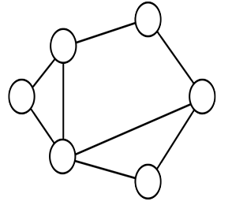

- Choix d'un sommet arbitraire à parcourir en premier :

	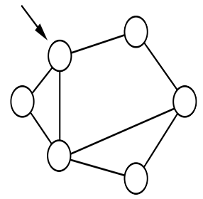

- Attribution d'une couleur disponible en fonction des voisins du sommet actuellement parcouru :

	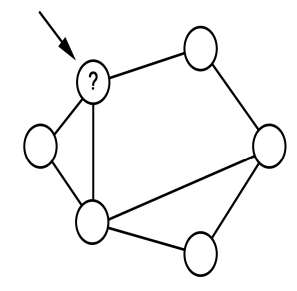 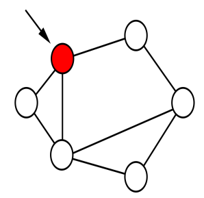

	- Couleurs utilisées : Rouge (0)

- On effectue la même démarche pour tous les voisins du sommet précédemment parcouru. Pour rappel, on attribut une couleur à un sommet avec la plus petite couleur non utilisée par un de ses voisins déjà colorié :

	- Premier voisin :

		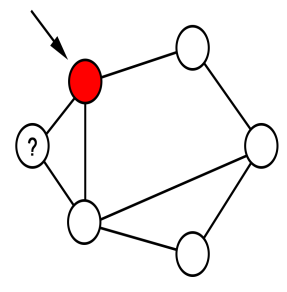 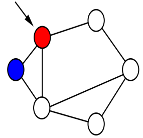

		- Couleurs utilisées : Rouge (0), Bleu (1)

	- Second voisin :
	
		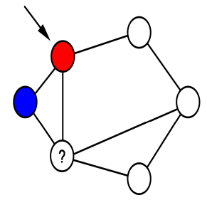 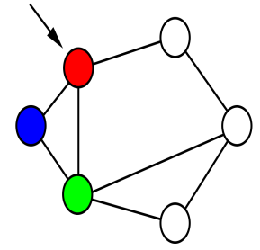

		- Couleurs utilisées : Rouge (0), Bleu (1), Vert (2)

	- Troisième voisin :
	
		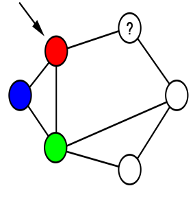 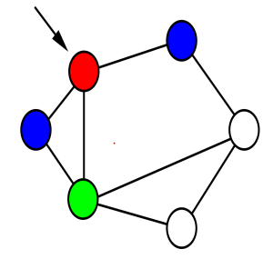

Puis on reprend la même démarche pour les voisins des voisins du premier sommet parcouru.

- Choix d'un sommet arbitraire parmi les voisins des voisins non parcourus :

	- Premier voisin :
	
		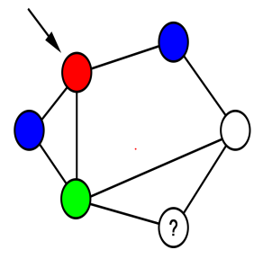 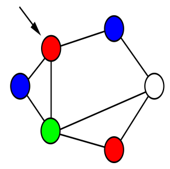

		- Couleurs utilisées : Rouge (0), Bleu (1), Vert (2)
	
		- Ici on remarque le choix de la couleur rouge qui est la plus petite couleur non utilisée par un des voisins du sommet actuellement parcouru.

	- Second voisin :

		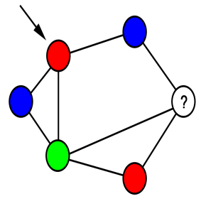 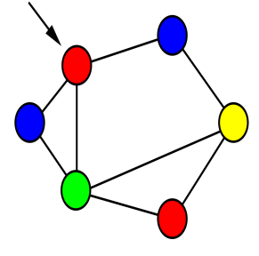

		- Couleurs utilisées : Rouge (0), Bleu (1), Vert (2), Jaune (3)

		- Ici nous sommes obligés de choisir une couleur que le rouge, bleu et vert qui sont déjà présent sur tous les autres voisins du sommet à colorié 

Le graphe est complétement colorié avec l'utilisation de 4 couleurs. Hors pour bien mettre en évidence le fait que cette approche naïve
ne permet pas toujours d'obtenir la solution optimale. Nous allons montrer qu'il était possible en effectuant un choix différent de parcouru de sommet
d'obtenir l'utilisation de moins de couleur pour colorier ce graphe.

Si l'on retourne en arrière et que l'on reprend le graphe partiellement colorié à cette étape :

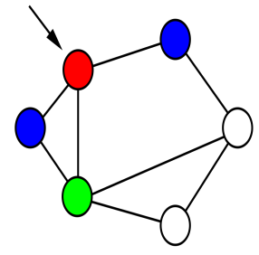

Et que l'on fait le choix de prendre le sommet non choisi lors de notre première coloration :

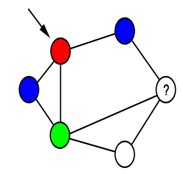 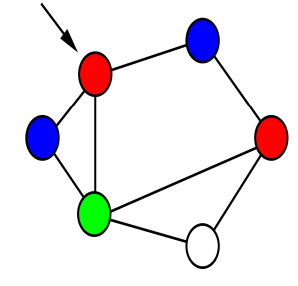

- Couleurs utilisées : Rouge (0), Bleu (1), Vert (2)

Alors on trouve une coloration valide du graphe avec un nombre chromatique inférieur à celui précédemment trouvé :

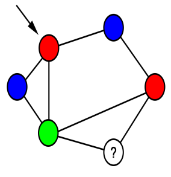 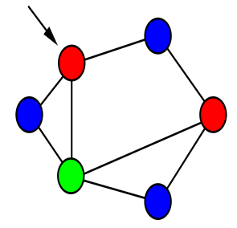

- Couleurs utilisées : Rouge (0), Bleu (1), Vert (2)

En effet on constante ici que l'on n'a pas besoin d'utiliser la couleur jaune en plus du rouge, bleu et vert.
Ainsi cet exemple montre bien les limites connues de l'algorithme glouton. Qui permet la coloration acceptable d'un graphe arbitraire
mais toujours optimale. L'optimabilité du nombre chromatique dans le cas de cet algorithme n'est pas contrôlable, car il dépend du parcours
des sommets du graphe au fur et à mesure de la coloration. Hors l'algorithme utilise un parcours arbitraire des sommets du graphe donné en entrée.

### Algorithme

Nous pouvons définir l'algorithme glouton par le pseudo-code suivant :

* algoGlouton(G):
	```
	Entrée : un graphe G simple non orienté

	Sortie : la liste des couleurs des sommets de G
	```
	- V $`\leftarrow`$ liste des sommets de $`G`$ dans un ordre quelconque ordonné (exmemple décroissant de degré)
	- l_color $`\leftarrow`$ list(0,...,0) # liste de $`n`$ zéro où $`n`$ est la longueur de $`V`$
	
	- Pour tout sommet $`s \in V`$ :
		- $`c`$ $`\leftarrow`$ plusPetiteCouleur($`G`$,$`s`$)
		- l_color[$`s`$] = $`c`$
	
	- renvoyer l_color

où plusPetiteCouleur(sommet) est une fonction qui retourne la plus petite couleur non utilisé par les voisins du sommet donné en paramètre.

La valeur $`0`$ à l'index $`i`$ de la liste l_color indique que le sommet $`i`$ n'est pas colorié.
Et comme nous pouvons par exemple dans NetworkX considéré directement une couleur par un entier supérieur à $`0`$.
Alors attribut la valeur de la plus petite couleur par la fonction dans le tableau l_color pour le sommet actuel. 

Ainsi on retrouve le comportement décrit dans notre idée précédemment. Notre algorithme permet
un coloriage qui utilise au plus $`\Delta_{(G)} + 1`$ couleurs où $`\Delta_{(G)}`$ est le degré du graphe $`G`$.

### Complexité

En terme de complexité si l'on regarde notre algorithme. Nous utilisons la liste des sommets dans un ordre quelconque de manière ordonné (exemple ordre décroissant des degrés),
soit $`\mathcal{O}(\vert V\vert)`$. Ensuite nous bouclons sur l'ensemble des sommets $`V_{(G)}`$.
Dans cette boucle nous utilisons une fonction plusPetiteCouleur qui devra retourner la plus petite couleur non utilisé par les sommets voisins du sommet actuellement parcouru.
Ainsi cette fonction pour un graphe $`G`$ et pour un sommet donné $`s \in V_{(G)}`$ s'exécutera en $`\mathcal{O}(\Delta_s)`$ où $`\Delta_s`$ est le degré du sommet $`s`$ dans le graphe $`G`$. Comme nous appelons cette méthode à chaque tour de boucle
donc pour chaque sommet du graphe cela revient en une complexité de $`\mathcal{O}(\sum_{s \in V_{(G)}}{\Delta_s)}`$.

Comme nous sommes dans des graphes simples, alors la somme des degrés des sommets du graphe $`G`$ est égale à deux fois la cardinalité de l'ensemble des arêtes du graphe soit $`2 \times \vert E_{(G)}\vert`$.
Ce qui est une propriété des graphes simples.

Ainsi nous pouvons conclure en disant que notre algorithme glouton d'exécute donc en $`\mathcal{O}(\vert V_{(G)}\vert + \vert E_{(G)}\vert)`$.

Nous avons considérer que nous utilisons un ordre quelconque pour la liste $`V`$ dans notre algorithme.
Hors une amélioration de cet algorithme existe en utilisant la liste par ordre décroissant des degrés des sommets dans le graphe.
Ce qui est possible d'être fait en utilisant une méthode de tri efficace, soit au moins en $`O(\vert V_{(G)}\vert \times \log(\vert V_{(G)}\vert))`$.

Dans une telle amélioration la complexité sera donc en $`O(\vert V_{(G)}\vert \times \log(\vert V_{(G)}\vert)) + \vert E_{(G)}\vert)`$. Une fonction
tri_degre($`G`$) pourra pour un graphe $`G`$ donné retourne la liste dans l'ordre décroissant des degrés des sommets de $`G`$.
Ainsi dans notre pseudo code la ligne de la liste $`V`$ peut être modifier de cette façon :

- V $`\leftarrow`$ tri_degre($`G`$) # liste des sommets de $`G`$ dans l'ordre décroissant de leurs degrés.

## Algorithme heuristique

Nous allons dans cette partie présenté l'approche heuristique ainsi qu'un algorithme qui utilise cette approche et qui permet une meilleure solution que l'algorithmique glouton
précédemment proposé. Tout en reprend certains aspect de l'amélioration proposé à celui-ci à savoir un tri préalable des sommets du graphe en entrée,
avec une priorité donnée aux sommets de grand degré, ainsi que les sommets dont les voisins ont déjà obtenu le plus de couleurs différentes.

### Définition heuristique 

Note : certains paragraphes suivants sont une reformulation de citations. Source disponible dans la section citation, Daniel Cosmin PORUMBEL - Thèse de doctorat, ainsi que Wikipedia.

De manière générale l'heuristique est le fait d'avoir une approche par découverte. Et de manière plus précise dans les mathématiques,
l'heuristique est une méthode de calcul qui permet l'obtention d'une solution réalisable mais pas nécessairement optimale ou exacte pour un problème d'optimisation difficile.
Mais cette approche n'est pas la seule possible.

Effectivement les problèmes combinatoires dits difficile sont sources de recherche
intense dans plusieurs domaines liées aux algorithmes. Comme par exemple la théorie de complexité et l'algorithmique, l'optimisation, la recherche opérationnelle
ou encore l'intelligence artificielle. Le fruit de ces années de recherche permet notamment trois approches dites générique pour permettre la résolution des problèmes difficiles :

* étudier des classes d’instances qui admettent des algorithmes exacts efficaces,
* développer des algorithmes d’approximation de temps polynomial,
* développer des algorithmes heuristiques, métaheuristiques ou stochastiques.

Les algorithmes exactes peuvent actuellement résoudre uniquement des graphes aléatoires de petite taille, avec jusqu'à 80 sommets.
Ainsi les méthodes heuristiques dominent la recherche pour résoudre des problèmes de coloration générique sur des graphes qui ont plus de
quelques centaines de sommets. Les algorithmes heuristiques appartiennent principalement à trois approches de résolution :

* Construction séquentielle : méthode rapide mais pas particulièrement efficace
* Recherche locale : recherche Tabou, recherche locale itérée, Recherche à voisinage variable
* Méthode à basé de populations ou distrubées : algorithme hybride évolutionnistes ou distrubué, algorithme colonies de fourmis

Une heuristique s'impose quand les algorithmes de résolution exacte sont de complexité exponentielle, et dans beaucoup de problèmes difficiles.
L'utilisation d'une heuristique est également permettre de calculer une solution approchée d'un problème
ou pour accélérer le processus de résolution exacte. De manière générale une heuristique est conçue pour un problème particulier
en s'appuyant sur sa structure propre, mais les approches peuvent contenir des principes plus généraux.

Ainsi la méthode gloutonne que nous avons présentée précédemment est une heuristique.
Nous allons dans la partie suivante, proposer un algorithme connu de la littérature du problème de
la coloration des graphes qui est plus efficace que l'approche gloutonne.
Qui est l'algorithme de Welsh et Powell (1967) ainsi que l'application de l'heuristique DSATUR qui
permet de donner une coloration moins mauvaise dans le pire des cas.

Cette heuristique permet donc un parcours du graphe en fonction de certaines régles qui permettent une certaine optimabilité pour colorier le graphe.
C'est en sens également que l'on constante donc cette approche par découverte en fonction du parcours effectué dans le graphe.

### Idée

L'idée générale de l'algorithme de Welsh & Powell est de colorer séquentiellement un graphe donné,
en visitant les sommets par ordre décroissant de leur degré. Effectivement les sommets qui ont beeaucoup de voisins
sont plus difficiles à colorer ainsi il est donc nécessaire de les colorer en premier si l'on souhaite obtenir de bonnes colorations.

Ainsi nous parcourons cette liste des sommets du graphe qui est dans l'ordre décroissant de leur degré. Et à chaque fois que l'on parcourt
un sommet nous lui attribuons une couleur et nous attribuons la même couleur pour tous les sommets non-adjacents à ce sommet actuellement parcouru.
Nous effectuons cette démarche sur tous les sommets de la liste.

Nous comprenons rapidement que pour des graphes qui comportent beaucoup de sommets. La question
du tri qui permet l'obtention de la liste des sommets dans l'ordre décroissant de leur degré est donc important.
Effectivement il est nécessaire d'utiliser un algorithme de tri qui permet les meilleurs résultats en terme de complexité.
Nous pouvons par exemple citer un tri par comparaison ou encore un tri par dénombrement. Nous rediscuterons du choix que nous ferons
dans la section complexité.

Toute fois l'algorithme Welsh & Powell peut conclure aux pires colorations possibles pour un graphe donné.
C'est pourquoi l'heuristique DSATUR fut proposé pour venir améliorer le principe de l'algorithme Welsh & Powell
dans le but d'éviter d'aboutir en une pire coloration possible qui pose donc un soucis de complexité dans l'un des pires cas possible.

Cette heuristique proposé par Daniel Brélaz en 1979, vient introduire le degré de saturation des sommets que l'on $`DSAT(s)`$ pour un sommet $`s`$ donné.
Il s'obtient de la manière suivante pour un sommet $`s`$ donné d'un graphe $`G`$ donné :

* Si aucun sommet adjacent à $`s`$ dans $`G`$ n'est colorié alors :
	* $`DSAT(s) = \Delta_s`$
* Sinon :
	* $`DSAT(s)`$ est le nombre de couleurs différentes utilisées par les sommets adjacents à $`s`$  

Exemple :

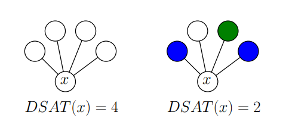

Ainsi les choix des sommets est fait sur un critère dynamique. Cette heuristique est l'une des plus connues pour le problème de coloration.

Le principe est donc maintenant de toujours partir de la liste des sommets du graphe par ordre décroissant de degrés,
de colorer le sommet parcouru, donc le sommet de degré maximum non coloré, par la couleur la plus petite possible.
Choisir un sommet de degré de saturation maximum comme exprimé précédemment. En cas d'égalité nous prenons le sommet de degré maximal.
Puis colorer ce sommet avec la plus petite couleur possible. Si tous les sommets sont colorés alors on arrête.
Sinon nous recommençons la démarche à partir de la sélection d'un sommet avec le grand degré de saturation.

Note : les images suivantes sont toutes reprises du document de L. Jourdan disponible en citations.

Nous proposons de donner un exemple de l'application de DSATUR sur un graphe donné :

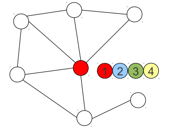

Ici nous commeçons par colorier le sommet de degré maximum par la couleur Rouge de valeur 1.
Puis nous devons choisir un sommet avec un $`DSAT`$ maximum. Nous pouvons constater que comme
nous avons colorier le sommet au milieu et que c'est le seul sommet colorier alors tous les sommets adjacents 
à celui-ci on un $`DSAT`$ égal à 1. Nous sommes donc dans le cas d'une égalité :

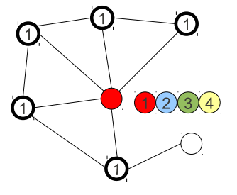

On choisit donc un sommet de degré maximum, et on le colorie avec la couleur la plus petite disponible.
Et l'on mets donc à jour les $`DSAT`$ des sommets : 

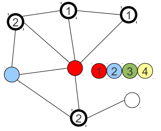

On refaire cette démarche tant que tous les sommets ne sont pas colorés. Ce qui donne pour finir la coloration du graphe :

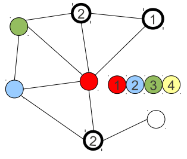

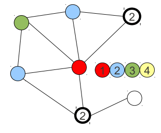

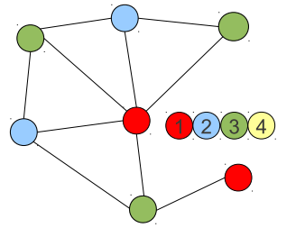

### Algorithme Welsh & Powell

Nous présentons tout de même le fonctionnement de l'algorithme Welsh & Powell
avant de passer à la partie concernant DSATUR.

Nous avons donc l'algorithme suivant :
```
    Entree : G = (S, A)
    Sortie : G coloré

    M <- Dictionnaire des sommets par degré
    L <- Liste de sommets ordonnés par ordre décroissant des degrés
    couleur <- 0
 1  Tant que L non vide faire :
        couleur <- couleur + 1
        S <- soummet courant de L
        Colorier S de la couleur courante
        Eliminer S de L
        V <- Liste des voisins de S
 2      Pour chaque x de L faire :
 3          Si x n'est pas dans L faire :
                Colorier x avec la couleur courante
 4              Eliminer x de L
 5              Ajouter les voisins de x à V
```

Nous proposons l'application de cet algortihme au graphe simple suivant :

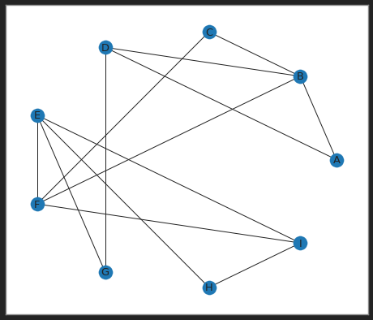

L'algorithme de Welsh-Powell prenant aussi en compte la recherche des degrés
pour chaque sommet et le tri des degrés dans l'ordre décroissant,
nous discuterons d'abord de la complexité sans ces derniers puis
nous évoquerons la complexité de chacun en plus de l'algorithme de coloration
en tant que tel.

Nous pouvons faire tourner à la main l'algorithme afin de mieux comprendre sur le graphe précédent :

```
L = F, E, B, D, I, A, C, G, H (liste donnée de manière ordonnée)
```

Première étape :
```
1) L non vide :
    couleur = 1
    F de couleur 1
    Eliminer F de L : L = E, B, D, I, A, C, G, H
    V = C, B, E, I
    Pour chaque x de L :
        E dans V, B dans V, D pas dans V :
            D de couleur 1
            Eliminer D de L : L = E, B, I, A, C, G, H
            V = C, B, E, I, A, G, B
        I dans V, A dans V, C dans V, G dans V, H pas dans V :
            H de couleur 1
            Eliminer H de L : L = E, B, I, A, C, G
            V = C, B, E, I, A, G, B, E, I
```

- Sommets de couleur 1 : F, D, H

La lite devient donc :

```
L = E, B, I, A, C, G
```

Deuxième étape :
```
2) L non vide :
    couleur = 2
    E de couleur 2
    Eliminer E de L : L = B, I, A, C, G
    V = G, H, I, F
    Pour chaque x de L :
        B pas dans V :
            B de couleur 2
            Eliminer B de L : L = I, A, C, G
            V = G, H, I, F, A, D, C, F
        I dans V, A dans V, C dans V, G dans V
```
- Sommets de couleur 2 : E, B

La liste devient donc :
```
L = I, A, C, G
```

Troisième étape :
```
3) L non vide :
    couleur = 3
    I de couleur 3
    Eliminer I de L : L = A, C, G
    V = F, E, H
    Pour chaque x dans L :
        A pas dans V :
            A de couleur 3
            Eliminer A de L : L = C, G
            V = F, E, H
        C pas dans V :
            C de couleur 3
            Eliminer C de L = G
            V = F, E, H, B, D, B, F
        G pas dans V :
            G de couleur 3
            Eliminer G de L : L vide
            V = F, E, H, B, D, B, F , D, E
```

- Sommets de couleur 3 : I, A, C, G

La liste devient donc : $`L = \emptyset`$

```
4) L Vide , donc Fin de l'algorithme

Nous avons ainsi :
    Sommets de couleur 1 : F, D, H
    Sommets de couleur 2 : E, B
    Sommets de couleur 3 : I, A, C, G
```

Nous obtenons ainsi le graphe coloré suivant : 

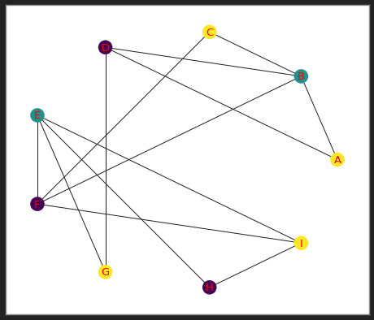

L'ensemble $`\{\{F, D, H\}, \{E, B\}, \{I, A, C, G\}\}`$ étant bien un ensemble de stables, la solution trouvée est ainsi correcte.

L'algorithme n'était pas optimal dans tout les cas, nous choisissons donc de discuter le pire et le meilleur des cas selon la complexité temporelle.
Le maxmimum de passage dans (1) se fait si l'on itère sur l'ensemble des sommets de L. Il faut donc que dans chaque itération de boucle en (1) on ne supprime que le sommet S colorié courant et que donc on ne supprime aucun élément suivant à S en (4).
Aucun sommet n'est supprimé en (4) si x dans V, il faut donc que chaque sommet S' du graphe soit voisin à S.
Nous nous retrouvons donc dans la configuration d'un graphe complet dans ce cas.

Nous proposons un graphe simple complet de 4 sommets afin de mieux visualiser ce cas :

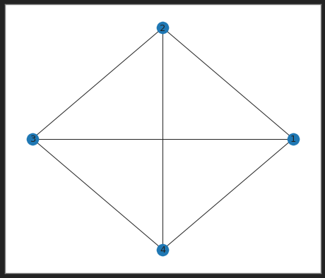

On a ainsi initialement L :
```
L = 1, 2, 3, 4
```

L'algorithme de recherche d'un sommet x parmi les voisins du sommet S s'arretant au moment ou il tombe sur lui-même, nous aurons donc les passages en boucle :

Première étape :

```
1) S = 1 | L = 2, 3, 4 | V = 2, 3, 4
   x = 2 => 1 passage en V
   x = 3 => 2 passages en V
   x = 4 => 3 passages en V
```

Seconde étape :

```
2) S = 2 | L = 3, 4 | V = 1, 3, 4
   x = 3 => 2 passages en V
   x = 4 => 3 passages en V
```

Troisième étape :

```
3) S = 3 | L = 4 | V = 1, 2, 4
   x = 4 => 3 passages en V
```
Quatrième étape :

```
4) S = 4 | L vide | V = 1, 2, 3
   aucun passage en V
```

On a pour ce graphe de 4 sommets : $`(1 + 2 + 3) + (2 + 3) + 3`$ passages dans V

Nous pouvons noter par ailleurs que l'ordre des voisins dans V est sans importance car dans tout les cas l'algorithme s'arête au moment ou l'élément x recherché est égal à l'élément d'index donné dans la liste (démonstration au pire).

Nous pouvons généraliser ainsi pour un graphe complet de $`|S|`$ sommets, nous avons :

$`SS = (1 + 2 + ... + |S| - 1) + ... + (|S| - 2 + |S] - 1) + |S| - 1 =`$ formule avec les sommes + passages dans V

$`Sk = (1 + 2 + ... + |S| - 1) =`$ 'valeur' étant la plus grande somme à effectuer, nous pouvons donc admettre que le reste des sommes dans SS seront au plus égales à Sk.

Nous pouvons ainsi conclure que nous avons une complexité dans le pire des cas de $`\mathcal{O}(n^2)`$.

Nous obtenons un seul passage par (1) lorsque les sommets de L sont fur et à mesure éliminés au niveau de (4). Il faut donc que tout les sommets voisins à S ne soient pas dans V, et que donc à leur tour les sommets éliminés n'aient pas de voisins dans V. Il faut donc qu'aucun sommet ne soit voisin l'un de l'autre.
Il s'agit donc d'avoir graphe nul ou tous les sommets sont isolés.
Nous avons ainsi dans ce cas V qui sera vide car aucun des sommets n'aura de voisins
et donc $`\vert S\vert - 1`$ passages par (3) et $`\vert S\vert`$ passages par (1).
La complexité dans le meilleur des cas est donc de  $`\mathcal{O}(\vert S\vert)`$

Il s’agit donc d’utiliser un ordre judicieux, dans le but d'obtenir une coloration la plus "acceptable" possible.
L’algorithme de Welsh & Powell consiste ainsi à colorer séquentiellement le graphe en visitant les sommets par ordre de
degré décroissant. L’idée est que les sommets ayant beaucoup de voisins seront plus difficiles à
colorer, et donc il faut les colorer en premier comem nous l'avons déjà expliqué auparavant.

La complexité d'un tel algorithme devient donc $`\mathcal{O}(\vert V\vert \times ln(\vert V\vert) + \vert E\vert)`$
en utilisant un tri par comparaison, mais reste $`\mathcal{O}(\vert V\vert + \vert E\vert)`$ avec un tri par dénombrement.
On peut toute fois obtenir des pires colorations possibles ($`\frac{\vert V\vert}{2}`$ couleurs
au lieu de 2). L’heuristique DSATUR propose une amélioration du principe de l’algorithme de Welsh & Powell afin d’éviter
ce problème.

### Algorithme

Nous pouvons ainsi définir l'algorithme utilisant l'heuristique DSATUR par le pseudo-code suivant :

- DSATUR($`G`$):
		
		Entrée : un graphe G connexe simple non orienté
		Sortie : la liste des couleurs des sommets de G

 * V $`\leftarrow`$ liste ordonnée des sommets suivant la valeur décroissante de leur degré
 * l_color $`\leftarrow`$ list(0,...,0) # liste de $`n`$ zéro ou $`n`$ est la cardinalité de $`V`$
 * Colorer le ou l'un des sommets de degré maximum avec la plus petite couleur possible
 * Tant que tous les sommets du graphe ne sont pas colorés :
	* $`s \leftarrow`$ sommet non coloré avec un degré de saturation maximum obtenu par la fonction $`DSAT(G)`$, en cas d'égalité on prend le sommet de degré maximum 
	* $`c \leftarrow`$ plusPetiteCouleur($`G,s`$)
	* l_color[$`s`$] = $`c`$
 * renvoyer l_color 

où plusPetiteCouleur(sommet) est une fonction qui retourne la plus petite couleur non utilisé par les voisins du sommet donné en paramètre.
Et $`DSAT(G)`$ est une fonction qui retourne le sommet non coloré avec le plus haut de degré de saturation ou en cas d'égalité le sommet de degré maximum parmis les égalités de degré de saturation.

Ainsi nous retrouvons le comportement évoqué du choix dynamique concernant l'ordre des sommets à parcourir.
Il est sujet à chaque étape de la coloration à être modifier pour permettre par découverte
en colorant les sommets qui respectent l'heuristique proposée mais qui de par son approche séquentielle
ne colore un seul sommet non déjà coloré à la fois. Toute fois la coloration ainsi obtenue n'est pas nécessairement une solution optimale
mais réalisable. Son auteur a notamment montré que son heuristique était capable de fournir en un temps court
comparer aux autres heuristiques et méthodes exactes, une coloration optimale dans 90% des cas.

### Complexité

Si l'on reprend le fonctionnement et la boucle de notre algorithme DSATUR. 
On peut constater qu'une fois que nous avons initialiser le premier $`DSAT(s)`$ à $`\Delta_s`$ on répète la démarche suivante :

* Choisir le sommet non coloré $`s`$ de $`DSAT`$ maximum
* Colorer $`s`$ avec la plus petite couleur possible/disponible
* Mettre à jour les $`DSAT(s')`$ avec $` \forall s' \in V_{(G)}`$ avec $`s' \neq s`$

Ainsi la complexité en temps avec l'application de l'heuristique DSATUR dépend de l'implémentation faite,
ainsi que le choix du tri proposé pour les sommets. La complexité peut donc être $`\mathcal{(O)}(\vert V\vert^2)`$
ou $`\mathcal{(O)}(\vert V\vert^2 + \vert V\vert \times \vert E\vert)`$ en fonction de la structure utilisée.

### En résumé

Nous pouvons résumer par le tableau suivant qui permet de mieux visualiser :

Heuristique   | Principe 	 | Complexité  | Idée| 
--------------|-------------|-------------|-----|
Welsh-Powell  | Colorer séquentiellement par ordre de degré décroissant	|$`\mathcal{O}(\vert V \vert + \vert E\vert)`$ ou $`\mathcal{O}(\vert V\vert \times ln(\vert V\vert) + \vert E\vert)`$| les sommets ayant le plus de voisins sont plus difficiles à colorer|
DSATUR        | Colorer les sommets par ordre de degré de saturation décroissant | $`\mathcal{O}(\vert V\vert^2)`$ ou $`\mathcal{O}(\vert V\vert^2 + \vert V\vert \times \vert E\vert)`$ |On colore d'abord les sommets qui ont le plus de voisins de couleurs différentes |

### Limites

L'algorithme Welsh & Powell permet d’obtenir une bonne coloration d’un graphe,
c’est-à-dire une coloration qui n'utilise pas un trop grand nombre de couleurs.
Toute fois il n’assure pas que le nombre de couleurs utilisé soit minimum, et donc égal au nombre chromatique du graphe.

Concernant l'heuristique DSATUR comme nous l'avons dit, son auteur a montré qu'il était capable de fournir
en un temps court une coloration optimale dans plus des 90% des cas. Cet algorithme est exact pour les graphes
bipartis, les graphes-cycle, monocycliques et bycycliques, les arbres, les colliers et les graphes-cactus.

Néanmoins DSATUR peut fournir une solution non exacte au problème de coloration dans certains cas.
Et ceux quel que soit l'ordre de parcours des sommets en cas d'égalité. Ce graphe possède 8 sommets et 12 arêtes.
C'est un graphe 3-colorable qui trompe l'algorithme DSATUR qui lui trouve une 4-coloration. 
Voici ce graphe qui représente donc le contre-exemple et donc les limites de DSATUR dans certains cas :

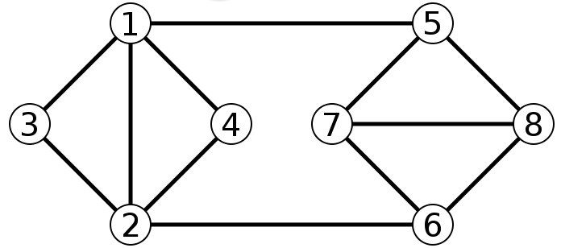

## Citations

* [Sophie Tison, ACT - Complexité de Problèmes: les propriétés NP-dures](https://www.fil.univ-lille1.fr/portail/archive19-20/~tison/AAC/C19/C7.pdf)
* [La NP-complétude, Johanne Cohen LRI-CNRS, Orsay](https://www.lri.fr/~jcohen/documents/enseignement/Cours-NP-completude.pdf)
* [Wikipedia - Coloration de graphe](https://fr.wikipedia.org/wiki/Coloration_de_graphe#Algorithmes)
* [L. Jourdan - Du problème concret à son modèle et sa résolution : Exemple en optimsation - Conférence 2018](http://jeia.fil.univ-lille1.fr/conferences/2018-jourdan.pdf)
* [Wikipedia - Heuristique (mathématiques)](https://fr.wikipedia.org/wiki/Heuristique_(math%C3%A9matiques))
* [Daniel Cosmin PORUMBEL, Algorithmes Heuristiques et Techniques d’Apprentissage, Applications au Probleme de Coloration de Graphe - Thèse de doctorat](http://cedric.cnam.fr/~porumbed/papers/theseFr.pdf)
* [Thibault Allançon - Tri par dénombrement](https://haltode.fr/algo/tri/tri_denombrement.html)
* [Wikipedia - DSATUR](https://fr.wikipedia.org/wiki/DSATUR)
* [INTRODUCTION AUX PROBLEMES COMBINATOIRES "DIFFICILES" : LE PROBLEME DU VOYAGEUR DE COMMERCE ET LE PROBLEME DE COLORATION D'UN GRAPHE](http://ressources.aunege.fr/nuxeo/site/esupversions/2b1c56b6-109d-488a-94a3-3ea525f8beef/ModAidDec/cours/l10/l10.pdf)
* [Allocation de Fréquences par Coloration de Graphes](https://members.loria.fr/JDumas/files/tipe/rapport.pdf)
